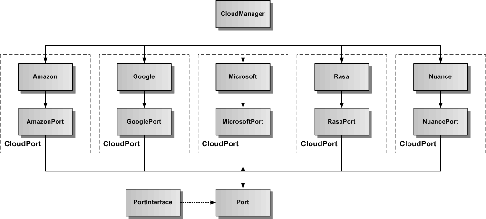

# Speech-Framework Cloud Dienste

Die Cloud-Dienste fügen dem Speech-Framework dynamisch weitere Funktionalität über Port Wrapper-Klassen aus der Cloud hinzu. Die Port-API definiert eine [abstrakte generische Schnittstelle](./CloudPort.md), die konkrete Cloud-Dienste auf die gleiche Art und Weise im Framework zur Verfügung stellt.

Folgende Cloud-Dienste sind bereits implementiert:

* **[Amazon Cloud-Dienst](./amazon/Amazon.md):** Amazon Coud-Dienst für die Verbindung zum Amazon Sprach-Server
* **[Google Cloud-Dienst](./google/Google.md):** Google Coud-Dienst für die Verbindung zum Google Sprach-Server
* **[Microsoft Cloud-Dienst](./microsoft/Microsoft.md):** Microsoft Coud-Dienst für die Verbindung zum Microsoft Sprach-Server
* **[Rasa Cloud-Dienst](./rasa/Rasa.md):** Rasa Coud-Dienst für die Verbindung zum privaten Rasa Sprach-Server
* **[Nuance Cloud-Dienst](./nuance/Nuance.md):** Nuance Coud-Dienst für die Verbindung zum Nuance Mix-Server (deprecated)

