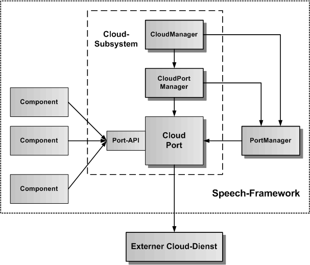

# Speech-Framework CloudPort

Hier wird der CloudPort als Konzept und Wrapper zwischen dem Speech-Framework und einen externen Coud-Dienst beschrieben. Die Port-API definiert dabei eine abstrakte generische Schnittstelle, die konkrete Cloud-Dienste auf die gleiche Art und Weise im Framework zur Verfügung stellt.

In der obigen Grafik ist das Cloud-Subsystem mit dem CloudPort und dem Port-API im Zentrum dargestellt. Darüber kommt der CloudPortManager, der den CloudPort verwaltet. Darüber kommt der CloudManager, der alle CloudPortManager verwaltet. Rechts neben dem CloudPort ist der PortManager, der alle Ports zusammen mit ihren Namen speichert. Über den PortManager kann jeder CloudPort geholt werden. Der CloudPort hat eine direkte Verbindung zu seinem externen Cloud-Dienst, dessen konkrete Funktionen und Schnittstellen der CloudPort abstrahiert und über die generische Port-API allen Komponenten des Speech-Frameworks verfügbar macht.

