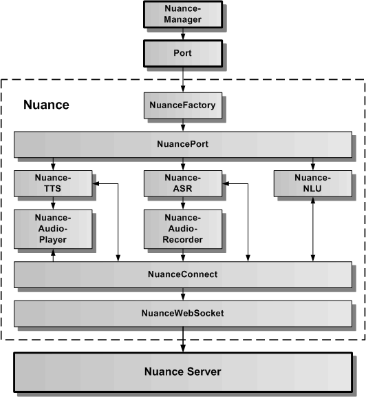

# Nuance Cloud-Dienst

Der Nuance Cloud-Dienst verbindet das Speech-Framework über die generische Port-Schnittstelle mit dem Nuance-Server. Der Nuance Cloud-Dienst dient zur Spracheingabe, Sprachausgabe und zur Sprachanalyse.
Um ihn verwenden zu können, ist ein Account bei Nuance-Mix notwendig. Für die Sprachanalyse müssen entsprechende Sprachmodelle in Nuance-Mix erstellt werden. Diese erlauben die Zuordnung ziwschen einer Spracheingabe und einem Intent. Der Intent kann in der Web-App weiterverarbeitet werden.

In der oberen Grafik wird die Architektur des Nuance Cloud-Dienstes als Wrapper für den Nuance Server dargestellt. Über die statische Nuance-Verwaltungsklasse kann auf NuancePort mit Hilfe des generischen Port-APIs zugegriffen werden. Die NuanceFactory erzeugt einen NuancePort, der seinerseits die Wrapper-Klassen für die NuanceTTS, NuanceASR und die NuanceNLU beinhaltet. Diese greifen direkt über NuanceConnect und NuanceWebSocket auf den Nuance Server zu. Der NuanceAudioPlayer dient dazu, einen vom Nuance Server empfangenen Audiostream lokal im Browser abzuspielen. Der NuanceAudioRecorder dient dazu, über das lokale Mikrofon einen Audiostream aufzunehmen und zum Nuance Server zu senden.

