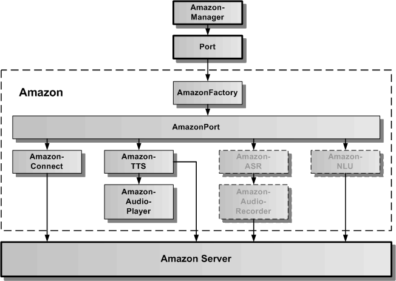
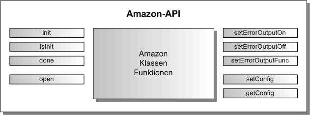

# Amazon Cloud-Dienst

Der Amazon Cloud-Dienst verbindet das Speech-Framework über die generische Port-Schnittstelle mit dem Amazon-Server. Der Amazon Cloud-Dienst dient zur Spracheingabe, Sprachausgabe und zur Sprachanalyse.
Um ihn verwenden zu können, ist ein Account bei Amazon AWS notwendig. Für die Sprachanalyse müssen entsprechende Sprachmodelle in Amazon erstellt werden. Diese erlauben die Zuordnung zwischen einer Spracheingabe und einem Intent. Der Intent kann in der Web-App weiterverarbeitet werden.

In der oberen Grafik wird die Architektur des Amazon Cloud-Dienstes als Wrapper für den Amazon Server dargestellt. Über die statische Amazon-Verwaltungsklasse kann auf AmazonPort mit Hilfe des generischen Port-APIs zugegriffen werden. Die AmazonFactory erzeugt einen AmazonPort, der seinerseits die Wrapper-Klassen für die AmazonTTS, AmazonASR und die AmazonNLU beinhaltet. Diese greifen direkt auf den Amazon Server zu. Der AmazonAudioPlayer dient dazu, einen vom Amazon Server empfangenen Audiostream lokal im Browser abzuspielen. Der AmazonAudioRecorder dient dazu, über das lokale Mikrofon einen Audiostream aufzunehmen und zum Amazon Server zu senden.

## Amazon API

Die Amazon-API besteht aus der statischen Klasse Amazon und ihrer statischen Klassenfunktionen. In der folgenden Abbildung sind alle öffentlichen Klassenfunktionen aufgeführt.

### Aamazon.init( optionList: AmazonOptionInterface ): number

Mit dem Aufruf:

	const result = Amazon.init( optionList );
	
wird das Amazon Subsystem als Anbindung an den Amazon Cloud-Dienst initialisiert. Als result wird 0 für erfolgreich und -1 für einen aufgetretenen Fehler zurückgegeben. 

Das AmazonOptionInterface defniert folgende optionale Parameter:

	export interface AmazonOptionInterface {
	    /** legt den konkreten Port fest, der geladen werden soll, wird hier AmazonMock angegeben, wird der Mock geladen */
	    amazonPortName?: string;
	    /** legt die URL fuer die Verbindung zum Server fest */
	    amazonServerUrl?: string;
	    /** legt dynamische Konfigurierbarkeit fest */
	    amazonDynamicCredentialsFlag?: boolean;
	    /** legt die REGION fuer die Verbindung zum Server fest */
	    amazonRegion?: string;
	    /** legt die IdentityPoolId fuer die Verbindung zum Server fest */
	    amazonIdentityPoolId?: string;
	    /** legt die Fehlerausgabe fest */
	    errorOutputFlag?: boolean;
	}

Die wichtigsten Parameter werden hier nochmal aufgeführt:

* **amazonPortName:** hier kann man "AmazonPort" oder "AmazonMock" als Portname angeben. AmazonMock verbindet sich nicht mit dem Amazon Cloud-Dienst kann für die Unit-Tests verwendet werden.
* **amazonDynamicCredentialsFlag:** wird hier true angegeben, können die Amazon-Credentials Region und IdentityPoolId auch später über Amazon.setConfig( aConfigData ) übergeben werden. Wird hier false angegeben oder der Parameter nicht eingetragen, müssen die folgenden Parameter amazonRegion und amazonIdentityPoolId eingetragen sein.
* **amazonRegion:** hier wird die Region des Amazon AWS-Servers angegeben. Muss vorhanden sein, wenn amazonDynamicCredentialsFlag false ist oder nicht eingetragen wurde.
* **amazonIdentityPoolId:** hier wird die IdentityPollId von Amazon als Credentials angegeben. Muss vorhanden sein, wenn amazonDynamicCredentialsFlag false ist oder nicht eingetragen wurde.

### Amazon.isInit(): boolean

Mit dem Aufruf:

	if ( Amazon.isInit()) {...}
	
kann geprüft werden, ob das Amazon Subsystem bereits initialisiert wurde. Es wird true oder false zurückgegeben.

### Amazon.done(): number

Mit dem Aufruf:

	const result = Amazon.done();
	
wird das Amazon Subsystem wieder freigegeben. Die Verbindung zum externen Amazon-Server wird beendet. Danach kann das Amazon Subsystem erneut mit neuen optionalen Parametern initialisiert werden. 

### Amazon.open( openEventCallback: any): number

Mit dem Aufruf:

	const result = Amazon.open((error, portName, portResult) => {...}); 

wird der AmazonPort mit dem externen Amazon-Server verbunden. In result wird 0 für erfolgreich und -1 für einen aufgetretenen Fehler zurückgegeben.
 
Die openEventCallback-Funktion gibt drei Werte zurück, der erste Wert ist ein Fehler oder null, der zweite Wert beinhaltet den Portnamen und der dritte Wert das Ergebnis 0 oder -1 für erfolgreiches Öffnen des AmazonPort oder nicht. Bei -1 wurde auch ein Fehler übergeben. Die Definition der openEnventCallback-Funktion sieht folgendermaßen aus:
 
	const openEventCallback = ( error: Error, portName: string, portResult: number ) => {
		// hier kann auf das OpenEvent entsprechend den Rückgabewerten reagiert werden
	}
	
	
### Amazon.setConfig( configData: AmazonConfigDataInterface ): number

Mit dem Aufruf:

	const result = Amazon.setConfig( configData );
	
können die Amazon-Credentials nach der Initialisierung des Amazon Subsystems eingetragen werden, wenn beim Aufruf von Amazon.init( optionList ) als optionaler Parameter amazonDynamicCredentialsFlag: true übergeben worden ist. Ansonsten wird hier -1 zurückgegeben und die Amazon-Credentials nicht eingetragen.

Das AmazonConfigDataInterface beinhaltet folgende Parameter:

	export interface AmazonConfigDataInterface {
	    /** legt die Region fuer die Verbindung zum Server fest */
	    amazonRegion: string;
	    /** legt die IdentityPoolId fuer die Verbindung zum Server fest */
	    amazonIdentityPoolId: string;
	}

### Amazon.getConfig(): AmazonConfigDataInterface

Mit dem Aufruf:

	const configData = Amazon.getConfig();
	
kann man die aktuell eingetragenen Amazon-Credentials auslesen.
