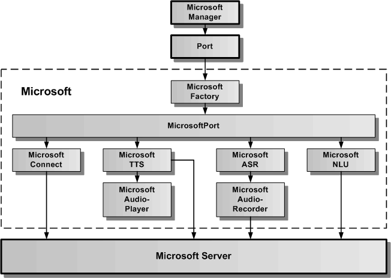

# Microsoft Cloud-Dienst

Der Microsoft Cloud-Dienst verbindet das Speech-Framework über die generische Port-Schnittstelle mit dem Microsoft-Server. Der Microsoft Cloud-Dienst dient zur Spracheingabe, Sprachausgabe und zur Sprachanalyse.
Um ihn verwenden zu können, ist ein Account bei Microsoft Azure notwendig. Für die Sprachanalyse müssen entsprechende Sprachmodelle in Microsoft erstellt werden. Diese erlauben die Zuordnung zwischen einer Spracheingabe und einem Intent. Der Intent kann in der Web-App weiterverarbeitet werden.

In der oberen Grafik wird die Architektur des Microsoft Cloud-Dienstes als Wrapper für den Microsoft-Server dargestellt. Über die statische Microsoft-Verwaltungsklasse kann auf MicrosoftPort mit Hilfe des generischen Port-APIs zugegriffen werden. Die MicrosoftFactory erzeugt einen MicrosoftPort, der seinerseits die Wrapper-Klassen für die MicrosoftTTS, MicrosoftASR und die MicrosoftNLU beinhaltet. Diese greifen direkt auf den Microsoft-Server zu. Der MicrosoftAudioPlayer dient dazu, einen vom Microsoft-Server empfangenen Audiostream lokal im Browser abzuspielen. Der MicrosoftAudioRecorder dient dazu, über das lokale Mikrofon einen Audiostream aufzunehmen und zum Microsoft-Server zu senden.

## Microsoft API

Die Microsoft-API besteht aus der statischen Klasse Microsoft und ihrer statischen Klassenfunktionen. In der folgenden Abbildung sind alle öffentlichen Klassenfunktionen aufgeführt.

### Microsoft.init( optionList: MicrosoftOptionInterface ): number

Mit dem Aufruf:

	const result = Microsoft.init( optionList );
	
wird das Microsoft Subsystem als Anbindung an den Microsoft Cloud-Dienst initialisiert. Als result wird 0 für erfolgreich und -1 für einen aufgetretenen Fehler zurückgegeben. 

Das MicrosoftOptionInterface defniert folgende optionale Parameter:

	export interface MicrosoftOptionInterface {
	    /** legt den konkreten Port fest, der geladen werden soll, wird hier MicrosoftMock angegeben, wird der Mock geladen */
	    microsoftPortName?: string;
	    /** legt die URL fuer die Verbindung zum Server fest */
	    microsoftServerUrl?: string;
	    /** legt dynamische Konfigurierbarkeit fest */
	    microsoftDynamicCredentialsFlag?: boolean;
	    /** legt die REGION fuer die Verbindung zum Server fest */
	    microsoftRegion?: string;
	    /** legt den SubscriptionKey fuer die Verbindung zum Server fest */
	    microsoftSubscriptionKey?: string;
	    /** legt den Endpunkt fuer Luis (NLU) fuer die Verbindung zum Server fest */
	    microsoftLuisEndpoint: string;
	    /** legt die Fehlerausgabe fest */
	    errorOutputFlag?: boolean;
	}

Die wichtigsten Parameter werden hier nochmal aufgeführt:

* **microsoftPortName:** hier kann man "MicrosoftPort" oder "MicrosoftMock" als Portname angeben. MicrosoftMock verbindet sich nicht mit dem Microsoft Cloud-Dienst kann für die Unit-Tests verwendet werden.
* **microsoftDynamicCredentialsFlag:** wird hier true angegeben, können die Microsoft-Credentials Region und SubscribtionKey auch später über Microsoft.setConfig( aConfigData ) übergeben werden. Wird hier false angegeben oder der Parameter nicht eingetragen, müssen die folgenden Parameter microsoftRegion und microsoftSubscriptionKey eingetragen sein.
* **microsoftRegion:** hier wird die Region des Microsoft Azure-Servers angegeben. Muss vorhanden sein, wenn microsoftDynamicCredentialsFlag false ist oder nicht eingetragen wurde.
* **microsoftSubscriptionKey:** hier wird der SubscriptionKey von Microsoft als Credentials angegeben. Muss vorhanden sein, wenn microsoftDynamicCredentialsFlag false ist oder nicht eingetragen wurde.
* **microsoftLuisEndpoint:** hier wird der LUIS-Endpunkt von Microsoft als Credentials angegeben. Muss vorhanden sein, wenn Microsoft LUIS als NLU verwendet werden soll.

### Microsoft.isInit(): boolean

Mit dem Aufruf:8

	if ( Microsoft.isInit()) {...}
	
kann geprüft werden, ob das Microsoft Subsystem bereits initialisiert wurde. Es wird true oder false zurückgegeben.

### Microsoft.done(): number

Mit dem Aufruf:

	const result = Microsoft.done();
	
wird das Microsoft Subsystem wieder freigegeben. Die Verbindung zum externen Microsoft-Server wird beendet. Danach kann das Microsoft Subsystem erneut mit neuen optionalen Parametern initialisiert werden. 

### Microsoft.open( openEventCallback: any): number

Mit dem Aufruf:

	const result = Microsoft.open((error, portName, portResult) => {...}); 

wird der MicrosoftPort mit dem externen Microsoft-Server verbunden. In result wird 0 für erfolgreich und -1 für einen aufgetretenen Fehler zurückgegeben.
 
Die openEventCallback-Funktion gibt drei Werte zurück, der erste Wert ist ein Fehler oder null, der zweite Wert beinhaltet den Portnamen und der dritte Wert das Ergebnis 0 oder -1 für erfolgreiches Öffnen des MicrosoftPort oder nicht. Bei -1 wurde auch ein Fehler übergeben. Die Definition der openEnventCallback-Funktion sieht folgendermaßen aus:
 
	const openEventCallback = ( error: Error, portName: string, portResult: number ) => {
		// hier kann auf das OpenEvent entsprechend den Rückgabewerten reagiert werden
	}
	
	
### Microsoft.setConfig( configData: MicrosoftConfigDataInterface ): number

Mit dem Aufruf:

	const result = Microsoft.setConfig( configData );
	
können die Microsoft-Credentials nach der Initialisierung des Microsoft Subsystems eingetragen werden, wenn beim Aufruf von Microsoft.init( optionList ) als optionaler Parameter microsoftDynamicCredentialsFlag: true übergeben worden ist. Ansonsten wird hier -1 zurückgegeben und die Microsoft-Credentials nicht eingetragen.

Das MicrosoftConfigDataInterface beinhaltet folgende Parameter:

	export interface MicrosoftConfigDataInterface {
	    /** legt die Region fuer die Verbindung zum Server fest */
	    microsoftRegion: string;
	    /** legt den SubscriptionKey fuer die Verbindung zum Server fest */
	    microsoftSubscriptionKey: string;
	    /** legt den Endpunkt fuer Luis (NLU) fuer die Verbindung zum Server fest */
	    microsoftLuisEndpoint: string;
	}

### Microsoft.getConfig(): MicrosoftConfigDataInterface

Mit dem Aufruf:

	const configData = Microsoft.getConfig();
	
kann man die aktuell eingetragenen Microsoft-Credentials auslesen.
