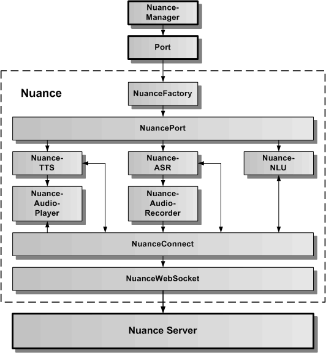
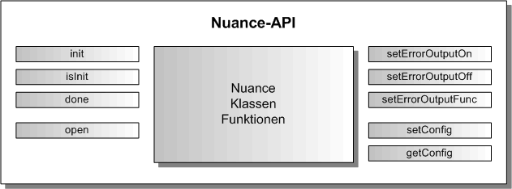

# Nuance Cloud-Dienst (deprecated)

Der Nuance Cloud-Dienst verbindet das Speech-Framework über die generische Port-Schnittstelle mit dem Nuance-Server. Der Nuance Cloud-Dienst dient zur Spracheingabe, Sprachausgabe und zur Sprachanalyse.
Um ihn verwenden zu können, ist ein Account bei Nuance-Mix notwendig. Für die Sprachanalyse müssen entsprechende Sprachmodelle in Nuance-Mix erstellt werden. Diese erlauben die Zuordnung zwischen einer Spracheingabe und einem Intent. Der Intent kann in der Web-App weiterverarbeitet werden.

In der oberen Grafik wird die Architektur des Nuance Cloud-Dienstes als Wrapper für den Nuance Server dargestellt. Über die statische Nuance-Verwaltungsklasse kann auf NuancePort mit Hilfe des generischen Port-APIs zugegriffen werden. Die NuanceFactory erzeugt einen NuancePort, der seinerseits die Wrapper-Klassen für die NuanceTTS, NuanceASR und die NuanceNLU beinhaltet. Diese greifen direkt über NuanceConnect und NuanceWebSocket auf den Nuance Server zu. Der NuanceAudioPlayer dient dazu, einen vom Nuance Server empfangenen Audiostream lokal im Browser abzuspielen. Der NuanceAudioRecorder dient dazu, über das lokale Mikrofon einen Audiostream aufzunehmen und zum Nuance Server zu senden.

## Nuance API

Die Nuance-API besteht aus der statischen Klasse Nuance und ihrer statischen Klassenfunktionen. In der folgenden Abbildung sind alle öffentlichen Klassenfunktionen aufgeführt.

### Nuance.init( optionList: NuanceOptionInterface ): number

Mit dem Aufruf:

	const result = Nuance.init( optionList );
	
wird das Nuance Subsystem als Anbindung an den Nuance Cloud-Dienst initialisiert. Als result wird 0 für erfolgreich und -1 für einen aufgetretenen Fehler zurückgegeben. 

Das NuanceOptionInterface defniert folgende optionale Parameter:

	export interface NuanceOptionInterface {
	    /** legt den konkreten Port fest, der geladen werden soll, wird hier NuanceMock angegeben, wird der Mock geladen */
	    nuancePortName?: string;
	    /** legt die URL fuer die Verbindung zum Server fest */
	    nuanceServerUrl?: string;
	    /** legt dynamische Konfigurierbarkeit fest */
	    nuanceDynamicCredentialsFlag?: boolean;
	    /** legt die App-ID fuer die Verbindung zum Server fest */
	    nuanceAppId?: string;
	    /** legt den App-Key fuer die Verbindung zum Server fest */
	    nuanceAppKey?: string;
	    /** legt die User-ID fuer die Verbindung zum Server fest */
	    nuanceUserId?: string;
	    /** legt den NLU-TAG fuer die Verbindung zum Server fest */
	    nuanceNluTag?: string;
	    /** legt den Pfad fuer die nuance.json Datei fest. Muss immer mit / abgeschlossen werden */
	    nuanceConfigPath?: string;
	    /** legt den Dateinamen fuer die nuance.json Datei fest */
	    nuanceConfigFile?: string;
	    /** legt fest, ob die Config-Datei geladen wird */
	    nuanceConfigLoadFlag?: boolean;
	    /** legt die Fehlerausgabe fest */
	    errorOutputFlag?: boolean;
	}

Die wichtigsten Parameter werden hier nochmal aufgeführt:

* **nuancePortName:** hier kann man "NuancePort" oder "NuanceMock" als Portname angeben. NuanceMock verbindet sich nicht mit dem Nuance Cloud-Dienst kann für die Unit-Tests verwendet werden.
* **nuanceDynamicCredentialsFlag:** wird hier true angegeben, können die Nuance-Credentials AppId und AppKey auch später über Nuance.setConfig( aConfigData ) übergeben werden. Wird hier false angegeben oder der Parameter nicht eingetragen, müssen die folgenden Parameter nuanceAppId und nuanceAppKey eingetragen sein.
* **nuanceAppId:** hier wird die AppId von Nuance als Credentials angegeben. Muss vorhanden sein, wenn nuanceDynamicCredentialsFlag false ist oder nicht eingetragen wurde.
* **nuanceAppKey:** hier wird der AppKey von Nuance als Credentials angegeben. Muss vorhanden sein, wenn nuacneDynamicCredentialsFlag false ist oder nicht eingetragen wurde.
* **nuanceNluTag:** NluTag als Nuance Parameter für die NLU. Muss angegeben sein, wenn Intents ermittelt werden.

### Nuance.isInit(): boolean

Mit dem Aufruf:

	if ( Nuance.isInit()) {...}
	
kann geprüft werden, ob das Nuance Subsystem bereits initialisiert wurde. Es wird true oder false zurückgegeben.

### Nuance.done(): number

Mit dem Aufruf:

	const result = Nuance.done();
	
wird das Nuance Subsystem wieder freigegeben. Die Verbindung zum externen Nuance-Server wird beendet. Danach kann das Nuance Subsystem erneut mit neuen optionalen Parametern initialisiert werden. 

### Nuance.open( openEventCallback: any): number

Mit dem Aufruf:

	const result = Nuance.open((error, portName, portResult) => {...}); 

wird der NuancePort mit dem externen Nuance-Server über eine WebSocket verbunden. In result wird 0 für erfolgreich und -1 für einen aufgetretenen Fehler zurückgegeben.
 
Die openEventCallback-Funktion gibt drei Werte zurück, der erste Wert ist ein Fehler oder null, der zweite Wert beinhaltet den Portnamen und der dritte Wert das Ergebnis 0 oder -1 für erfolgreiches Öffnen des NuancePort oder nicht. Bei -1 wurde auch ein Fehler übergeben. Die Definition der openEnventCallback-Funktion sieht folgendermaßen aus:
 
	const openEventCallback = ( error: Error, portName: string, portResult: number ) => {
		// hier kann auf das OpenEvent entsprechend den Rückgabewerten reagiert werden
	}

### Nuance.setConfig( configData: NuanceConfigDataInterface ): number

Mit dem Aufruf:

	const result = Nuance.setConfig( configData );
	
können die Nuance-Credentials nach der Initialisierung des Nuance Subsystems eingetragen werden, wenn beim Aufruf von Nuance.init( optionList ) als optionaler Parameter nuanceDynamicCredentialsFlag: true übergeben worden ist. Ansonsten wird hier -1 zurückgegeben und die Nuance-Credentials nicht eingetragen.

Das NuanceCondigDataInterface beinhaltet folgende Parameter:

	export interface NuanceConfigDataInterface {
	    /** legt die App-ID fuer die Verbindung zum Server fest */
	    nuanceAppId: string;
	    /** legt den App-Key fuer die Verbindung zum Server fest */
	    nuanceAppKey: string;
	    /** legt den NLU-TAG fuer die Verbindung zum Server fest */
	    nuanceNluTag?: string;
	}

von denen die AppId und der AppKey als gültige Nuance-Credentials eingetragen sein müssen. Der NluTag ist nur notwendig, wenn auch die Nuance-NLU für die Intent-Ermittlung verwendet werden soll.

### Nuance.getConfig(): NuanceConfigDataInterface

Mit dem Aufruf:

	const configData = Nuance.getConfig();
	
kann man die aktuell eingetragenen Nuance-Credentials auslesen.
