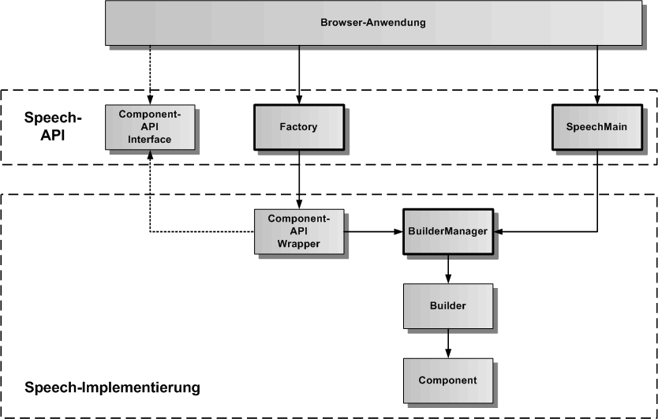

# Komponentenmodell

Das im Speech-Framework implementierte Komponentenmodell trennt das Interface sauber von der eigentlichen Implementierung. Der Kern des Komponentenmodells ist bereits im Core definiert. Die Base-Komponente legt zusätzlich ein Komponenten-Protokoll für die zu exportierenden Speech-Hauptkomponenten fest. 

In der oberen Grafik ist das Komponentenmodell schematisch dargestellt. Unten ist eine beliebige Komponente dargestellt, darüber ihr Builder und darüber der BuilderManager als Singleton, der alle Builder des Speech-Frameworks verwaltet. Der Component-API-Wrapper hat direkten Zugriff auf den BuilderManager und holt sich den zur Komponente passenden Builder und erzeugt damit die Komponente. Die Factory darüber erzeugt den Component-API-Wrapper, der das Component-API-Interface implementiert. Die Browser-Anwendung hat nur Zugriff auf das Component-API-Interface und die jeweilige Factory der Komponente, die ebenfalls ein Singleton ist. Das SpeechMain Singleton ganz rechts hat die Aufgabe, alle anderen Bestandteile der Speech-Implementierung zu initialisieren. Hier werden alle Komponenten-Builder im BuilderManager erzeugt. 

