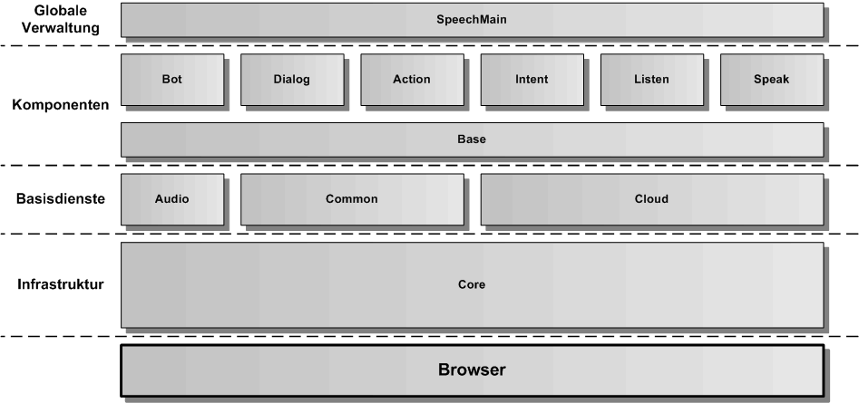
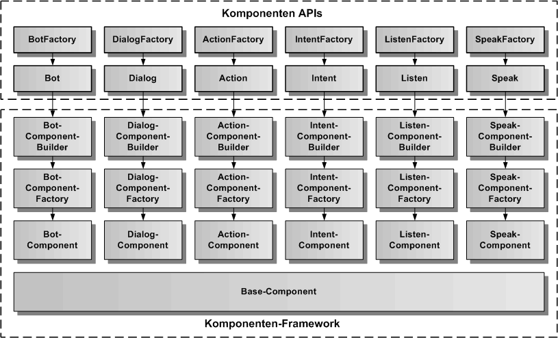

# Design des Speech-Frameworks

Die Architektur des Speech-Framework umfasst verschiedene Komponenten und Basisdienste, die jeweils das API für ein Feature des Frameworks für Web-Apps zur Verfügung stellen. Das Framework basiert auf einem zentralen Kern-Framework (Core), das Basiskonzepte für die Erzeugung, Struktur und Kommunikation der einzelnen Komponenten beinhaltet.

Das Speech-Framework ist vollständig in Typescript geschrieben. Hier wird ein Überblick über die Architektur des Speech-Frameworks gegeben. Die Beschreibung der einzelnen Bestandteile erfolgt [hier](./../framework/Framework.md). 

In der oberen Grafik werden alle Bestandteile des Speech-Frameworks dargestellt. Der Core bildet die Infrastruktur des Frameworks, hier sind zentrale Designentscheidungen in Form von Basisklassen implementiert. 

Darüber kommen die Basisdienste, die konkrete Funktionalität implementieren oder als Wrapper-Klassen externe Dienste in das Speech-Framework importieren. Der Audio-Basisdienst liefert die Funktionalität für AudioPlayer und AudioRecorder. Der Common-Basisdienst beinhaltet verschiedene Html5-Klassen als Abstraktionen zu den Html5-APIs. 

Die Komponenten basieren auf einer Basiskomponente (Base), die die generischen Funktionen für alle Komponenten implementiert. Die Komponenten Speak und Listen dienen zur Sprachausgabe und Spracheingabe, Intent dient zur Sprachanalyse, um aus einem Text einen Intent zu extrahieren. Die Action-Komponente dient der Fernsteuerung von Aktionen in der Web-App. Die Dialog-Komponente erlaubt die Ausführung von Dialogen. Speak, Action und Dialog werden zusammen in der Bot-Komponente verwendet.

## Komponenten APIs

Die oberste Schicht des Speech-Frameworks bilden die Komponenten mit ihren APIs. Auf eine Komponente kann nur über ihr API zugegriffen werden. Die Komponente selbst ist nicht direkt verwendbar. 
Für die Erzeugung einer Komponenten-API wird eine Factory-API verwendet. Unterhalb der APIs befindet sich das Komponenten-Framework, bestehend aus Komponenten-Builder, Komponenten-Factory und der eigentlichen Komponente, die ihrerseits von der Base-Komponente erbt. 

Um auf eine Komponente über ihre API zugreifen zu können, wird zuerst die dazugehörige Factory-API verwendet. die Factory-API ist eine statische Klasse und erlaubt den direkten Zugriff auf die Funktionen der Klasse, ohne ein Factory-Objekt erzeugen zu müssen. Die Factory erzeugt dann das API-Objekt der Komponente, welches ein Wrapper für die gesamte Komponenten-Funktionalität ist. Das API stellt eine stabile Schnittstelle für den Web-Entwickler zur Verfügung, während die Komponente sich verändern kann. Später ist es möglich, für den Zugriff auf die Funktionen einer Komponente auch verschiedene API-Versionen zu verwenden.

Das der Komponenten-API zugrunde liegende Komponentenmodell ist [hier](./ComponentModel.md) beschrieben.

