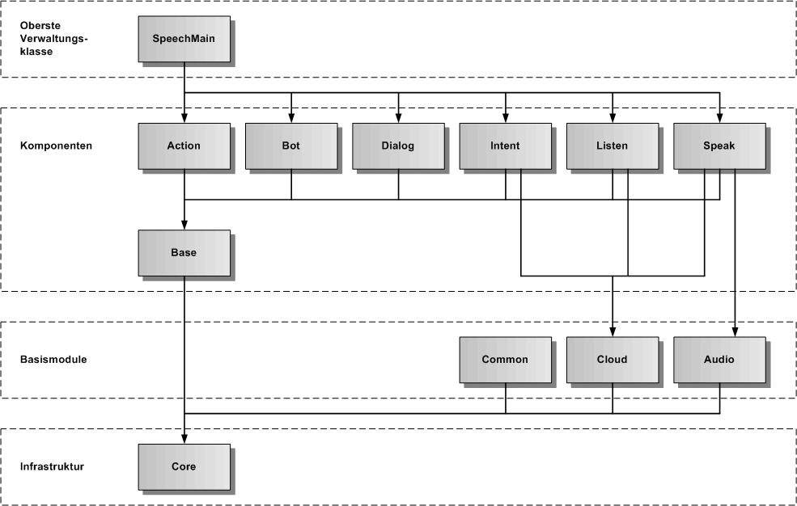

# Speech-Framework

In der nachfolgenden Grafik zur Gesamtarchitektur des Frameworks werden die einzelnen Bestandteile des Frameworks und ihre Importbeziehungen dargestellt.

## Oberste Verwaltungsklasse

* **SpeechMain:** erzeugt und verwaltet alle Komponenten des Speech-Frameworks

## Komponenten

* **[Action](./action/Action.md):** erlaubt die Ausführung von Aktionen
* **[Bot](./bot/Bot.md):** erlaubt die Ausführung eines Bot
* **[Dialog](./dialog/Dialog.md):** erlaubt die Ausführung eines Dialogs
* **[Intent](./intent/Intent.md):** erlaubt die Spracheingabe und gibt einen erkannten Intent zurück
* **[Listen](./listen/Listen.md):** erlaubt die Spracheingabe und gibt einen erkannten Text zurück
* **[Speak](./speak/Speak.md):** erlaubt die Sprachausgabe
* **[Base](./base/Base.md):** beinhaltet die Basisklassen für alle Speech-Komponenten

## Basismodule

* **[Common](./common/Html5.md):** beinhaltet Basisklassen für Html5
* **[Cloud](./../cloud/Cloud.md):** erzeugt und verwaltet alle Cloud-Dienste
* **[Audio](./audio/Audio.md):** erlaubt das Abspielen von Audiodateien

## Infrastruktur

* **[Core](./core/Core.md):** beinhaltet die Basisklassen und Schnittstellen für die Infrastruktur des Frameworks

