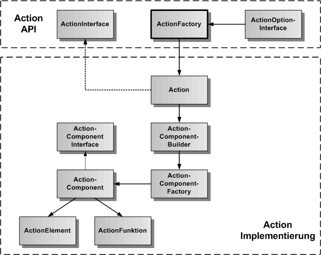
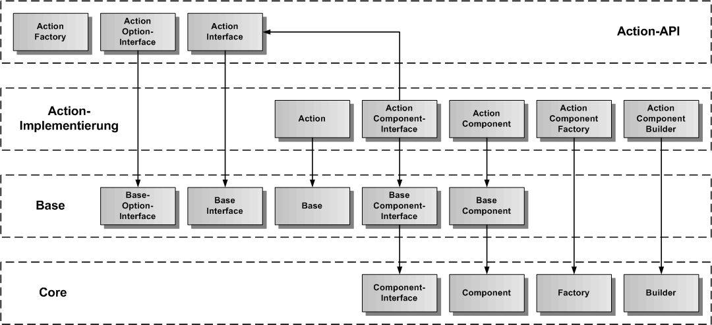
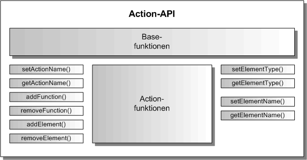

# Action Komponente

Die Action-Komponente ist eine exportierbare Hauptkomponente und erlaubt die Fernsteuerung einer Web-App über Aktionen. Sie erbt die generische Komponenten-API von der [Base-Komponente](./../base/Base.md), so dass hier nur noch die Funktionen beschrieben werden, die gegenüber der Base-Komponente hinzukommen.

## Action Architektur

In der folgenden Grafik ist die Architektur der Action-Komponente dargestellt. Entsprechend dem Komponentenmodell gibt es eine API-Schicht und eine Implementierung-Schicht. Es gibt die ActionFactory als Singleton in der API-Schicht, um ein Objekt der Klasse Action (API-Wrapper), die das ActionInterface implementiert, zu erzeugen. Die Action-Klasse kümmert sich um die Erzeugung des ActionComponent-Objektes mit ActionElement und ActionFunction als Plugins. Der ActionComponentBuilder erzeugt nicht nur das ActionComponent-Objekt, sondern auch alle inneren Objekte und ihre Verbindungen untereinander.

## Action Vererbungsstruktur

In der nächsten Grafik wird die Vererbungsstruktur der Action-Komponente dargestellt. Action erbt von Base und Base erbt von Core. Die Action-Komponente wird in Action-API und Action-Implementierung aufgeteilt. Zu sehen ist, von welcher Basisklasse die einzelnen Action-Klassen erben.

## Action API

Die Action-API erweitert die Base-API um die Action-Funktionen.

