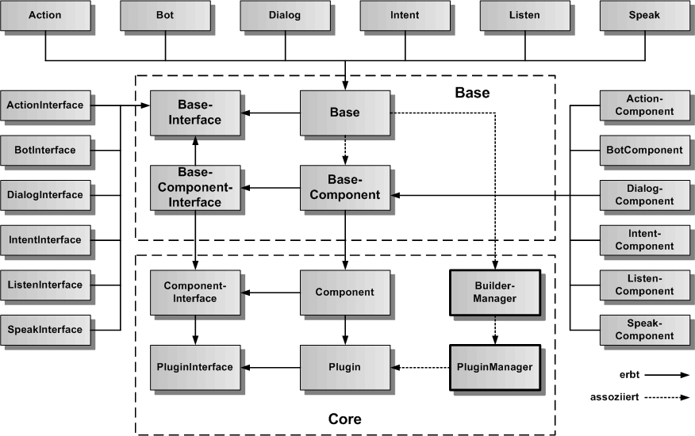
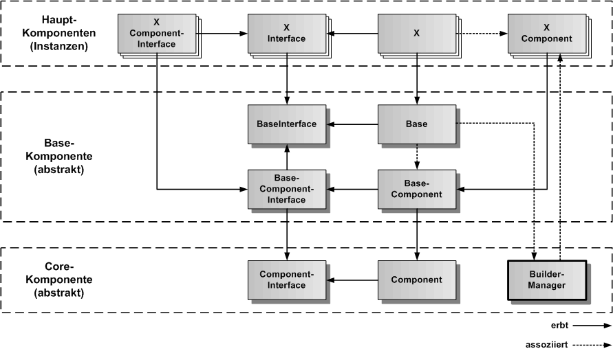
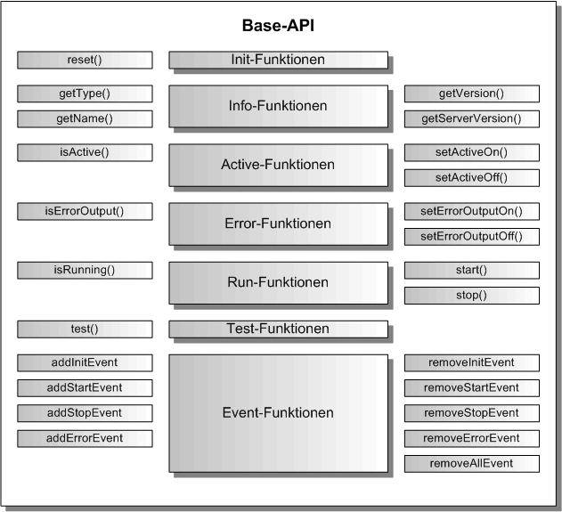

# Base Komponente

Die Base-Komponente definiert die generische Grundfunktionalität für alle Hauptkomponenten des Speech-Frameworks. Sie ist eine abstrakte Komponente, die nicht instanziiert wird. Alle Hauptkomponenten erben von der Base-Komponente, ihrem BaseInterface und ihrer Komponentenimplementierung. Die Base-Komponente erbt ihrerseits von der abstrakten Core-Komponente.

Als Hauptkompnenten sind alle exportierbaren Komponenten des Speech-Frameworks gemeint, die konkrete Instanzen erzeugen. 

## Base Architektur

In der folgenden Gesamtarchitekturgrafik sind die Base-Bibliothek mit den Base-Klassen und Teile der Core-Bibliothek mittig plaziert. Die von den Base-Klassen erbenden Klassen der Hauptkomponenten sind außen herum angeordnet. Die Base-Klassenerben iherseits von den Core-Klassen. 

Der PluginManager und der BuilderManager sind Singleton-Instanzen, die im Speech-Framework nur einmal vorkommen, die Objektinstanzen von Plugins und Buildern für die Hauptkomponenten verwalten.

## Base Vererbungsstruktur

Die konkrete Vererbungsstruktur der Base-Komponentenklassen ist in der folgenden Vererbungsgrafig dargestellt. Die unterste Ebene bilden die Basisklassen für die Komponente aus dem Core. Darüber kommen die Base-Klassen, die von den Basisklassen erben. Darüber kommen die eigentlichen Hauptkomponenten des Speech-Frameworks, von denen Instanzen erzeugt werden, die von den Base-Klassen erben. Diese Vererbungsstrukturen sind bei allen Komponenten gleich. Die X-Komponente ist daher ein Platzhalter für alle bereits im Speech-Framework implementierten und alle zukünftigen Komponenten. 

Hier können auch selbst programmierte Komponenten als Erweiterungen des Speech-Frameworks abgeleitet werden.

## Base API

Alle Hauptkomponenten haben das gleiche Grundprotokoll, mit dem sie verwendet werden können. Damit vereinfacht sich die Gesamt-API des Speech-Frameworks, da für alle Komponenten nur eine konkrete API verwendet wird, die sich pro Komponente um einige Funktionen erweitert. Das Base-API legt die Art und Weise fest, wie eine Komponente im eigenen Anwendungscode benutzt werden kann.    

### Init-Funktionen

In der Base-API Grafik ist bei den Init-Funktionen nur reset() angegeben. Es ist keine eigene init()-Funktion vorhanden, da die Komponente nicht über einen eigenen Konstruktor erzeugt wird, sondern über eine Komponenten-Fabrik. Bei der Erzeugung der Komponente wird sie auch gleich in der Fabrik initialisiert und als fertiges Komponentenobjekt zurückgegeben. Für 'Component' wird der jeweilige Name der konkreten Komponente eingesetzt.

Erzeugen einer Komponente:

	import { <Component>Factory } form '<component>-factory';
	import { <Component>Interface } from '<component>.interface';
	
	const component = <Component>Factory.create( '<Component>', {<Optionen>} );

Reset einer Komponente:

	component.reset({<Optionen>});
	

### Info-Funktionen

Die Info-Funktionen geben den Typ der Komponente, ihren Namen und ihre Version zurück. Sollte die Komponente als Client/Server-Version vorhanden sein, wird auch die Server-Version zurückgegeben.

		
	const type = component.getType();
	const name = component.getName();
	const version = component.getVersion(); 

### Active-Funktionen

Eine Komponente kann aktiviert und deaktiviert werden. Eine Komponente kann während der Initialisierung deaktiviert werden, wenn sie feststellt, dass sie ihre Funktion nicht erfüllen kann. Die Komponente kann aber auch durch außen von anderen Komponenten oder der Anwendung deaktiviert werden, wenn sie nicht ausgeführt werden soll. Ob eine Komponente aktiv ist, kann über isActive() abgefragt werden.

Komponente auf Aktiv setzen:

	component.setActiveOn();
	if ( component.isActive()) {
		console.log('Komponente ist aktiv');
	}

Komponente auf nicht Aktiv setzen:
  	
	component.setActiveOff();
	if ( !component.isActive()) {
		console.log('Komponente ist nicht aktiv');
	}

### Error-Funktionen

Um die Ausgabe von Fehlermeldungen auf die Konsole bei der Entwicklung und beim Testen steuern zu können, kann die Konsolenfehlerausgabe ein- und ausgeschaltet werden. Über setErrorOutputOn/Off oder die zu übergebenden optionalen Parameter kann errorOutput auf true gesetzt werden, um eine Konsolenfehlerausgabe einzuschalten. Standardmäßig ist die Konsolenfehlerausgabe abgeschaltet.

Fehlerausgabe für die Komponente einschalten:

	component.setErrorOutputOn();
	if ( component.isErrorOutput()) {
		console.log('Fehlerausgabe ist eingeschaltet');
	}

Fehlerausgabe für die Komponente ausschalten:

	component.setErrorOutputOff();
	if ( !component.isErrorOutput()) {
		console.log('Fehlerausgabe ist ausgeschaltet');
	}

### Run-Funktionen

Die Run-Funktionen definieren den aktuellen Ausführungszustand der Komponente. Über start() kann die Ausführung der Komponente gestartet werden, über stop() kann die Ausführung wieder beendet werden. Mit isRunnig() kann der Ausführungszustand überprüft werden. Es wird ein Resultwert von 0 oder -1 zurückgegeben. Die 0 bedeutet, alles OK, die -1 bedeutet, es ist ein Fehler aufgetreten. Der Fehler kann
als Event empfangen werden.

Starten der Ausführung der Komponente:

	const result component.start();
	
	if ( result === 0 ) {
		console.log('start() wurde fehlerfrei ausgefuehrt');
	}
	if ( result === -1 ) {
		console.log('in start() ist ein Fehler aufgetreten');
	}

	if ( component.isRunning()) {
		console.log('die Komponente wird gerade ausgefuehrt');
	}

	
Beenden der Ausführung der Komponente, wenn diese sich nicht selbst beendet, oder unterbrochen werden soll:

	const result component.stop();
	
	if ( !component.isRunning()) {
		console.log('die Komponente wurde gestoppt');
	}

### Test-Funktionen

Es gibt die Funktion test(), der man ein Testkommando und Testparamter übergeben kann, um die Komponente in Unit-Tests testen zu können.

	const testResult = component.test('<TestCommand>', {<TestParameter>});
	

### Event-Funktionen

Die Event-Funktione setzen und löschen Event-Callback Funktionen, mit denen Ereignisse verarbeitet werden können. Als Standardereignisse gibt es init, start, stop und error. Komponenten können eigene Ereignisse hinzufügen.

Eintragen des Init-Events:

	const result = component.addInitEvent('<CallerComponent>', (aPluginName: string) => {
		console.log('Komponente wurde initialisiert', aPluginName);
		return 0;
	});
	
	
Entfernen des Init-Events:

	const result = component.removeInitEvent('<CallerComponent>');

Eintragen des Start-Events:

	const result = component.addStartEvent('<CallerComponent>', () => {
		console.log('Komponente wurde gestartet');
		return 0;
	});
	
	
Entfernen des Start-Events:

	const result = component.removeStartEvent('<CallerComponent>');

Eintragen des Stop-Events:

	const result = component.addStopEvent('<CallerComponent>', () => {
		console.log('Komponente wurde gestoppt');
		return 0;
	});
	
	
Entfernen des Stop-Events:

	const result = component.removeStopEvent('<CallerComponent>');
	
	
Eintragen des Error-Events:

	const result = component.addErrorEvent('<CallerComponent>', (aError: any) => {
		console.log('Fehler in Komponente aufgetreten', aError);
		return 0;
	});
	
	
Entfernen des Error-Events:

	const result = component.removeErrorEvent('<CallerComponent>');
	
	
	