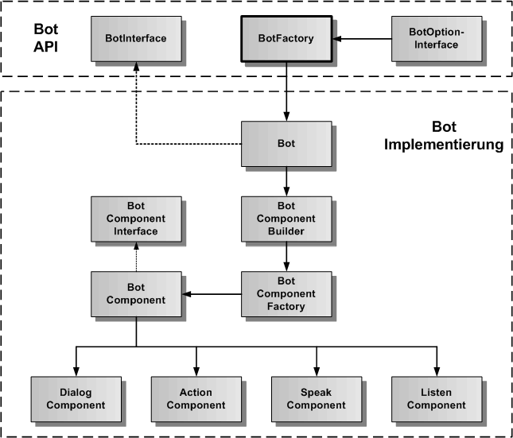
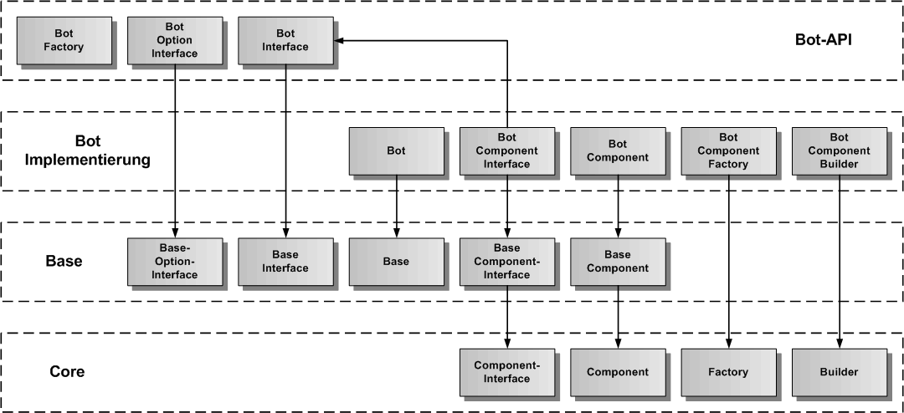
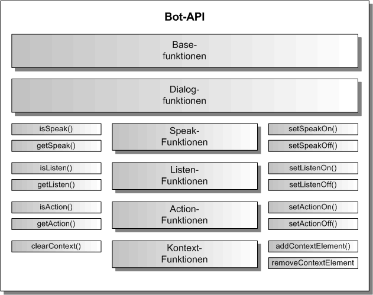

# Bot Komponente

Die Bot-Komponente definiert eine Kontroller-Komponente, die die Dialog-Komponente mit der Action-, Speak- und Listen-Komponente verbindet, um Dialoge nicht nur textuell, sondern auch über Sprachein- und -ausgabe zu führen und Aktionen auszuführen.

Die Bot-Komponente ist eine Erweiterung der Dialog-Komponente um Speak, Listen und Action. Die Dialog-Komponente wird [hier](./../dialog/Dialog.md) beschrieben.

Außerdem erbt die Bot-Komponente die generische Komponenten-API von der [Base-Komponente](./../base/Base.md), so dass hier nur noch die Funktionen beschrieben werden, die gegenüber der Base-Komponente hinzukommen.

## Bot Architektur

In der folgenden Grafik ist die Architektur der Bot-Komponente dargestellt. Entsprechend dem Komponentenmodell gibt es eine API-Schicht und eine Implementierung-Schicht. Es gibt die BotFactory als Singleton in der API-Schicht, um ein Objekt der Klasse Bot (API-Wrapper), die das BotInterface implementiert, zu erzeugen. Die Bot-Klasse kümmert sich um die Erzeugung des BotComponent-Objektes mit der Integration von DialogComponent, ActionComponent, SpeakComponent und ListenComponent als externe Plugins. Der BotComponentBuilder erzeugt nicht nur das BotComponent-Objekt, sondern auch alle inneren Objekte und ihre Verbindungen untereinander.

## Bot Vererbungsstruktur

In der nächsten Grafik wird die Vererbungsstruktur der Bot-Komponente dargestellt. Bot erbt von Base und Base erbt von Core. Die Bot-Komponente wird in Bot-API und Bot-Implementierung aufgeteilt. Zu sehen ist, von welcher Basisklasse die einzelnen Bot-Klassen erben.

## Bot API

Die Hauptaufgabe eines Bots ist es, einen Dialog mit dem Nutzer führen zu können. Zusätzlich soll der Bot in der Lage sein, in Abhägigkeit vom Dialog auch die App komplett zu steuern. damit wird erreicht, dass ein Nutzer dem Bot eine Aufgabe stellen kann, die dieser über die App-Steuerung von der App ausführen lässt. 
Damit wird eine sprachliche Äußerung vom Bot in eine Handlungsanweisung an die App übersetzt.

Dazu werden Aktionen vom Bot generiert und an die App zur Ausführung übergeben.
Die Bot-API erlaubt ihrerseits Zugriff auf die Action-, Speak und Listen-API. Diese drei inneren
Komponenten von Bot können auch abgeschaltet werden, so dass Bot als reiner ChatBot ohne Aktionen und Sprachein/ausgabe verwendet werden kann.

Die Ereignis-Schnittstelle erlaubt es, die entsprechenden Ereignisse aus dem Dialogmanager zu empfangen und selbständig zu verarbeiten. Die Speak-Komponente kann in Bot abgeschaltet werden,
ist aber immer noch global nutzbar. Das gleiche gilt für die Action- und die Listen-Komponente.

### Speak-Funktionen

Die Speak-Funktionen erlauben die Speak-Komponente im Bot ein- und auszuschalten. 

### Listen-Funktionen

Die Listen-Funktionen erlauben die Listen-Komponente im Bot ein- und auszuschalten.

### Action-Funktionen

Die Action-Funktionen erlauben die Action-Komponente im Bot ein- und auszuschalten.

### Kontext-Funktionen

Die Kontext-Funktionen erlauben die Übergabe von Kontext-Elementen, um den Dialog kontextabhängig zu steuern.