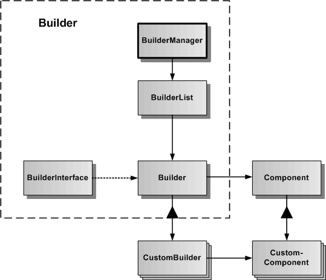

# Builder

Das Builder-Subsystem dient zur Verwaltung und Programmierung von CustomBuildern, die ihrerseits CustomComponents erzeugen. CustomBuilder und CustomComponent gehören zusammen.

In der Grafik werden die verschiedenen Klassen und Schnittstellen des Builder-Subsystems dargestellt.
Die Basisklasse ist Builder, von der spezialisierte CustomBuilder abgeleitet werden können. Zum Builder gehört auch ein abstraktes BuilderInterface, welches für alle CustomBuilder die globale API des Builders definiert. Der BuilderManager dient der Verwaltung aller im Framework erzeugten CustomBuilder und ist als statische Klasse realisiert, um im Framework ein Sigleton zu repräsentieren.

