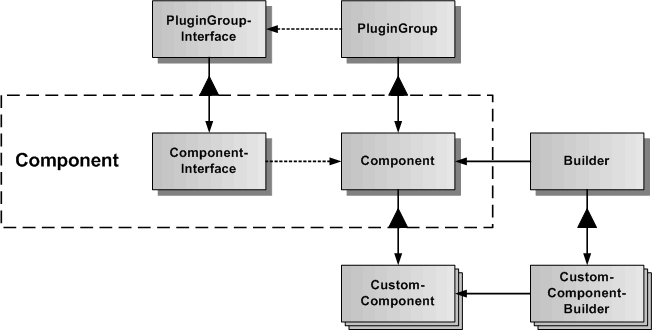

# Component

Das Component-Subsystem erweitert das Plugin zu einer vollwertigen Komponente und dient der programmierung von CustomComponents. Components sind erweiterte Plugins und werden zusammen mit denen im PluginManager verwaltet. Komponenten werden mittels der zugehörigen ComponentBuilder erzeugt. 

In der Grafik werden die verschiedenen Klassen und Schnittstellen des Component-Subsystems dargestellt.
Die Basisklasse ist Component, von der spezialisierte CustomComponents abgeleitet werden können. Zur Componente gehört auch ein abstraktes ComponentInterface, welches für alle CustomComponents die globale generische API der Component definiert. 

