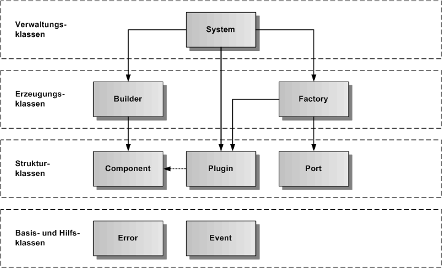

# Core Subsystem

Das Core-Subsystem beinhaltet alle Klassen für die gesamte Infrastruktur des Speech-Frameworks. Es ist von keinem anderen Subsystem des Speech-Frameworks abhängig. Alle anderen Subsysteme importieren Teile des Core-Subsystems.

Das Core-Subsystem liefert die Basisfunktionalität in Form von zu erbenden Klassen, um Komponenten zu programmieren, zu verwalten und miteinander über Ereignisse kommunizieren zu lassen. Das Core-Subsystem implementiert Basiskonzepte, wie Components, Builder, Factories, Plugins, Ports und Events, die die Architektur des gesamten Frameworks bestimmen.

In der nachfolgenden Grafik zur Gesamtarchitektur des Core-Subsystems werden die einzelnen Bestandteile des Core-Subsystems und ihre Importbeziehungen dargestellt.

## Verwaltungsklassen

* **[System](./System.md):** verwaltet alle Builder, Factories und Plugins des Speech-Frameworks

## Erzeugungsklassen

* **[Builder](./Builder.md):** verwaltet alle Builder für Komponenten und beinhaltet die Basisklasse für Builder
* **[Factory](./Factory.md):** verwaltet alle Factories und beinhaltet die Basisklasse für Factory

## Strukturklassen

* **[Component](./Component.md):** beinhaltet die Basisklasse für Component
* **[Plugin](./Plugin.md):** verwaltet alle Plugins und beinhaltet die Basisklasse für Plugins
* **[Port](./Port.md):** verwaltet alle Ports und beinhaltet die Basisklasse für Ports

## Basis- und Hilfsklassen

* **[Error](./Error.md):** beinhaltet die Basisklasse zur Fehlerbehandlung
* **[Event](./Event.md):** beinhaltet die Ereignisklassen

