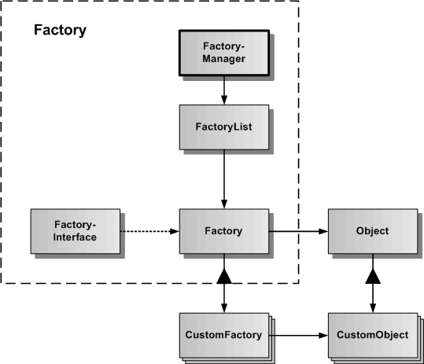

# Factory

Das Factory-Subsystem dient zur Verwaltung und Programmierung von CustomFactories, die ihrerseits beliebige Objekte erzeugen können. CustmoFactory und CustomObject gehören zusammen.

In der Grafik werden die verschiedenen Klassen und Schnittstellen des Factory-Subsystems dargestellt.
Die Basisklasse ist Factory, von der spezialisierte CustomFactories abgeleitet werden können. Zur Factory gehört auch ein abstraktes FactoryInterface, welches für alle CustomFactories die globale API der Factory definiert. Der FactoryManager dient der Verwaltung aller im Framework erzeugten CustomFactories und ist als statische Klasse realisiert, um im Framework ein Sigleton zu repräsentieren.

