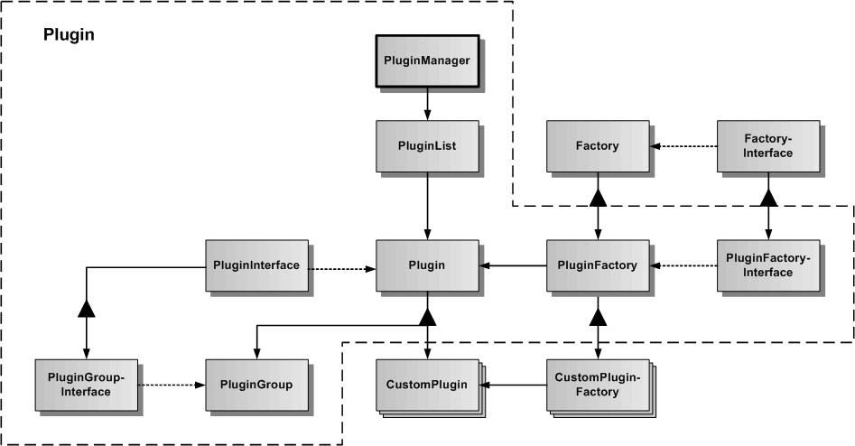

# Plugin

Das Plugin-Subsystem dient zur Verwaltung und Programmierung von CustomPluginFactories und CustomPlugins. Ein CustomPlugin implementiert eine konkrete Teilfunktionalität im Framework.

In der Grafik werden die verschiedenen Klassen und Schnittstellen des Plugin-Subsystems dargestellt.
Die Basisklasse ist Plugin, von der spezialisierte CustomPlugins abgeleitet werden können. Zum Plugin gehört auch ein abstraktes PluginInterface, welches für alle CustomPlugins die globale generische API des Plugins definiert. Parallel zu der Plugin-Klasse gibt es noch die PluginFactory-Klasse, von der spezialisierte CustomPluginFactories abgeleitet werden können. CustomPlugin und CustomPluginFactory gehören immer zusammen.
PluginGroup dient der Verwaltung mehrerer innerer Plugins. Der PluginManager dient der Verwaltung aller im Framework erzeugten CustomPlugins und ist als statische Klasse realisiert, um im Framework ein Sigleton zu repräsentieren.

