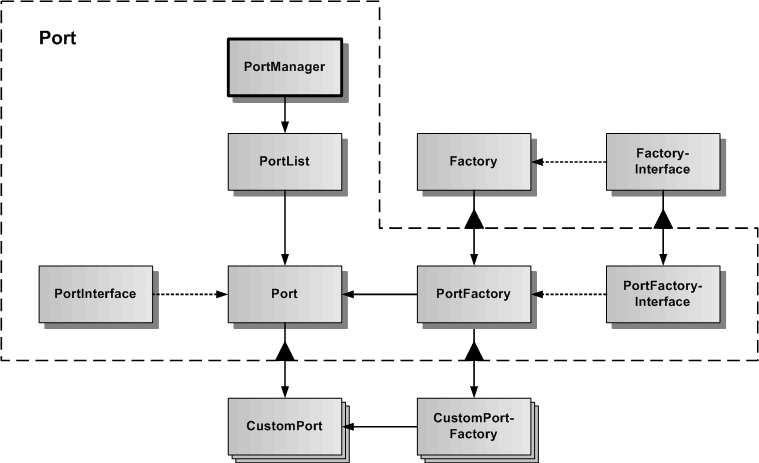

# Port

Das Port-Subsystem dient zur Verwaltung und Programmierung von CustomPortFactories und CustomPorts. Ein Port definiert eine Wrapper-API zu einem externen Dienst. Anders als Plugins, welche Funktionalität innerhalb des Frameworks implementieren, ist ein Port eine Abstraktion und Verbindung zu einer externen Funktionalität, die dem Framework so hinzugefügt wird. Ein Port ist vergleichbar mit der Geräteabstraktion in Betriebssystemen. 

In der Grafik werden die verschiedenen Klassen und Schnittstellen des Port-Subsystems dargestellt.
Die Basisklasse ist Port, von der spezialisierte CustomPorts abgeleitet werden können. Zum Port gehört auch ein abstraktes PortInterface, welches für alle CustomPorts die globale generische API des Ports definiert. Parallel zu der Port-Klasse gibt es noch die PortFactory-Klasse, von der spezialisierte CustomPortFactories abgeleitet werden können. CustomPort und CustomPortFactory gehören immer zusammen.
Der PortManager dient der Verwaltung aller im Framework erzeugten CustomPorts und ist als statische Klasse realisiert, um im Framework ein Sigleton zu repräsentieren.

