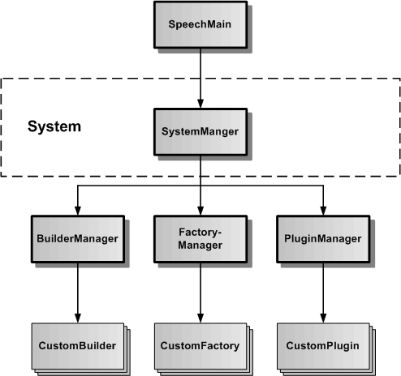

# System

Das System-Subsystem dient zur Verwaltung von Buildern, Factories und Plugins.

In der Grafik wird der SystemManager als einzige Klasse des System-Subsystems dargestellt. Der SystemManager dient der Verwaltung aller im Framework erzeugten CustomBuilder, CustomFactories und CustomPlugins. Sie ist als statische Klasse realisiert, um im Framework ein Sigleton zu repräsentieren. Der SystemManager ist seinerseits in die oberste Verwaltungsklasse des Frameworks, der statischen SpeechMain-Klasse, eingefügt.

