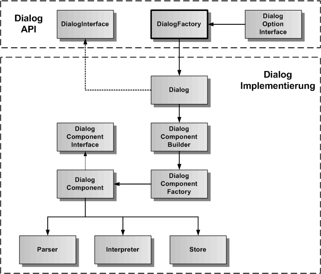
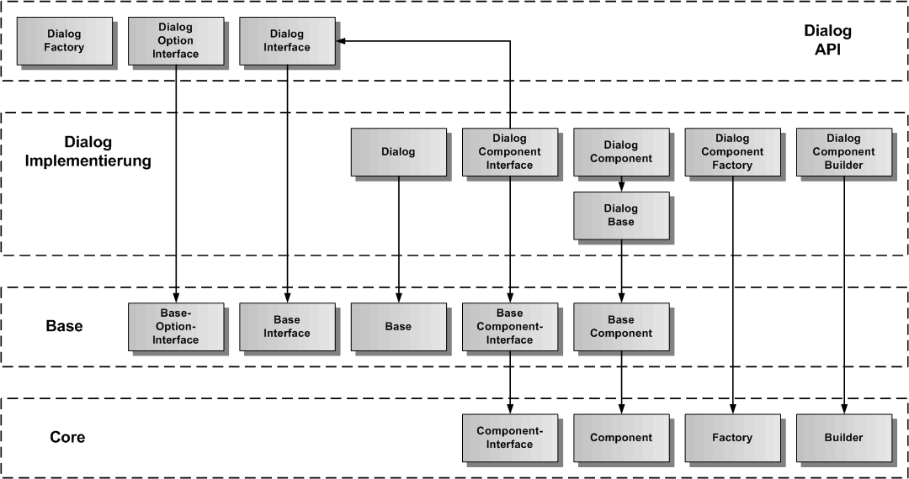
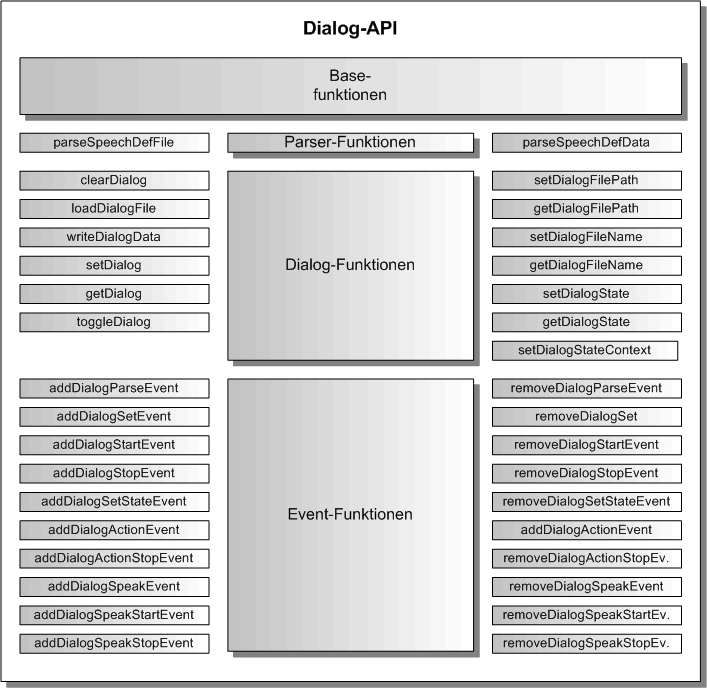

# Dialog Komponente

Die Dialog-Komponente beinhaltet einen Dialogmanager, der ein [Dialogskript](./DialogScript.md) interpretiert, wenn ein Dialog gestartet wird. Dabei wird ein bestimmter Dialogzustand eingestellt, der dann abgearbeitet wird. Der Dialogmanager erzeugt Aktionen und Sprachausgaben zu diesem Dialogzustand und berücksichtigt auch einen Dialogkontext zu diesem Dialogzustand. Damit können in Abhängigkeit vom Kontext Aktionen und Sprachausgaben dynamisch erzeugt oder unterdrückt werden.

Die Dialog-Komponente erbt die generische Komponenten-API von der [Base-Komponente](./../base/Base.md), so dass hier nur noch die Funktionen beschrieben werden, die gegenüber der Base-Komponente hinzukommen.

## Dialog Architektur

In der folgenden Grafik ist die Architektur der Action-Komponente dargestellt. Entsprechend dem Komponentenmodell gibt es eine API-Schicht und eine Implementierung-Schicht. Es gibt die DialogFactory als Singleton in der API-Schicht, um ein Objekt der Klasse Dialog (API-Wrapper), die das DialogInterface implementiert, zu erzeugen. Die Dialog-Klasse kümmert sich um die Erzeugung des DialogComponent-Objektes mit Parser, Interpreter und Store als Plugins. Der DialogComponentBuilder erzeugt nicht nur das DialogComponent-Objekt, sondern auch alle inneren Objekte und ihre Verbindungen untereinander.

## Dialog Vererbungsstruktur

In der nächsten Grafik wird die Vererbungsstruktur der Dialog-Komponente dargestellt. Dialog erbt von Base und Base erbt von Core. Die Dialog-Komponente wird in Dialog-API und Dialog-Implementierung aufgeteilt. Zu sehen ist, von welcher Basisklasse die einzelnen Dialog-Klassen erben.

## Dialog API

Die Dialog-API erweitert die Base-API um die Parser-, Dialog- und Event-Funktionen. Die Dialog API dient der Steuerung des Dialogmanagers.

### Parser-Funktionen

Die Parser-Funktionen dienen zur Übertragung des Dialogskriptes in den internen Dialogspeicher.

### Dialog-Funktionen

Die Dialog-Funktionen dienen der Einstellung der Dialogzustände des Dialoginterpreters.

### Event-Funktionen

Die Event-Funktionen fügen mehrere Dialog-Ereignisse den Basisereignissen hinzu. 
