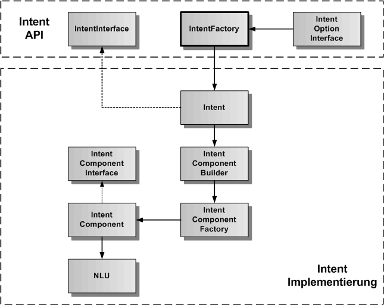
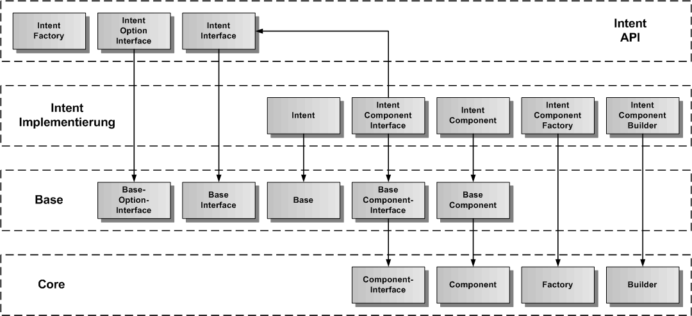
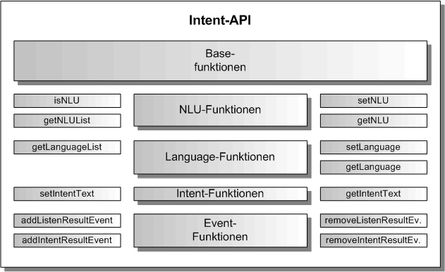

# Intent Komponente

Die Intent-Komponente ist eine exportierbare Hauptkomponente und erlaubt die Textanalyse zur Bestimmung der Satzbedeutung (Intent). Sie erbt die generische Komponenten-API von der [Base-Komponente](./../base/Base.md), so dass hier nur noch die Funktionen beschrieben werden, die gegenüber der Base-Komponente hinzukommen.

Die Intent-Komponente liefert zu einem übergebenen Text einen passenden Intent. Dazu benutzt sie den Nuance Cloud-Port, der eine NLU als Nuance-Service beinhaltet. 

## Intent Architektur

In der folgenden Grafik ist die Architektur der Intent-Komponente dargestellt. Entsprechend dem Komponentenmodell gibt es eine API-Schicht und eine Implementierung-Schicht. Es gibt die IntentFactory als Singleton in der API-Schicht, um ein Objekt der Klasse Intent (API-Wrapper), die das IntentInterface implementiert, zu erzeugen. Die Intent-Klasse kümmert sich um die Erzeugung des IntentComponent-Objektes mit der NLU als Plugin. Der IntentComponentBuilder erzeugt nicht nur das IntentComponent-Objekt, sondern auch alle inneren Objekte und ihre Verbindungen untereinander.

## Intent Vererbungsstruktur

In der nächsten Grafik wird die Vererbungsstruktur der Intent-Komponente dargestellt. Intent erbt von Base und Base erbt von Core. Die Intent-Komponente wird in Intent-API und Intent-Implementierung aufgeteilt. Zu sehen ist, von welcher Basisklasse die einzelnen Intent-Klassen erben.

## Intent API

Die Intent-API erweitert die Base-API um die NLU-, Language-, Intent und Event-Funktionen.

### NLU-Funktionen

Die NLU-Funktionen erlauben den Wechsel der NLU. Im Moment ist nur die Nuance-NLU implementiert.

### Language-Funktionen

Die Language-Funktionen erlauben den Wechsel der Sprache. Im Moment sind Deutsch und Englisch implementiert.

### Intent-Funktionen

Die Intent-Funktionen erlauben die Übergabe eines Textes für die Intent-Analyse. Wird kein Text vor Start der Komponente übergeben, wird automatisch die Nuance-ASR gestartet und es wird auf eine Spracheingabe gewartet. 

### Event-Funktionen

Die Event-Funktionen implementieren die Ereignisse für Listen und Intent. Das Listenereignis gibt den erkannten Text zurück, wenn die Nuance-ASR verwendet wurde (siehr unter Intent-Funktionen). Das Intent-Ereignis wird ausgelöst, wenn das Intent Analyseergebnis vom Nuance-Service zurückgegeben wurde. 