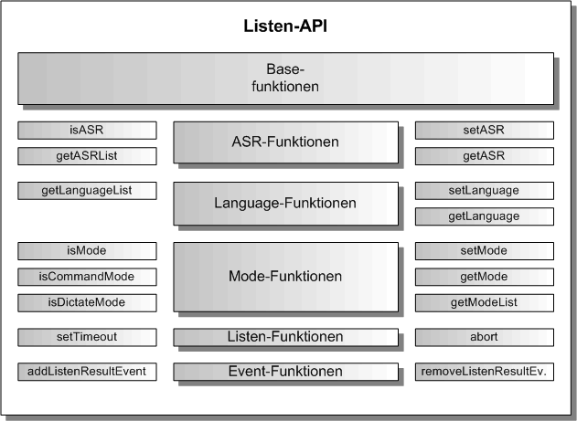

# Listen Komponente

Die Listen-Komponente ist eine exportierbare Hauptkomponente, sie erlaubt die Spracheingabe und gibt den erkannten Text zurück. Sie erbt die generische Komponenten-API von der [Base-Komponente](./../base/Base.md), so dass hier nur noch die Funktionen beschrieben werden, die gegenüber der Base-Komponente hinzukommen.

Die Listen-Komponente liefert zu einer Spracheingabe einen erkannten Text. In der Listen-Komponente sind zur Zeit zwei ASR implementiert, einmal die Html5-ASR mit Web Speech-Recognition API, und die andere ASR ist von Nuance. Dazu benutzt die Listen-Komponente den Nuance Cloud-Port, der eine ASR als Nuance-Service beinhaltet.

## Listen Architektur

In der folgenden Grafik ist die Architektur der Listen-Komponente dargestellt. Entsprechend dem Komponentenmodell gibt es eine API-Schicht und eine Implementierung-Schicht. Es gibt die ListenFactory als Singleton in der API-Schicht, um ein Objekt der Klasse Listen (API-Wrapper), die das ListenInterface implementiert, zu erzeugen. Die Listen-Klasse kümmert sich um die Erzeugung des ListenComponent-Objektes mit der ASR als Plugin. Der ListenComponentBuilder erzeugt nicht nur das ListenComponent-Objekt, sondern auch alle inneren Objekte und ihre Verbindungen untereinander.

## Listen Vererbungsstruktur

In der nächsten Grafik wird die Vererbungsstruktur der Listen-Komponente dargestellt. Listen erbt von Base und Base erbt von Core. Die Listen-Komponente wird in Listen-API und Listen-Implementierung aufgeteilt. Zu sehen ist, von welcher Basisklasse die einzelnen Listen-Klassen erben.

## Listen API

Die Listen-API erweitert die Base-API um die ASR-, Language-, Listen- und Event-Funktionen.

### ASR-Funktionen

Die ASR-Funktionen erlauben den Wechsel der ASR. Im Moment sind die Html5-ASR und die Nuance-ASR implementiert.

### Language-Funktionen

Die Language-Funktionen erlauben den Wechsel der Sprache. Im Moment sind Deutsch und Englisch implementiert.

### Mode-Funktionen

Die Mode-Funktionen erlauben den Wechsel des Eingabemodus. Im Moment sind Command und Dictate implementiert. Mit dem Command Modus kann man eine kurze Spracheingabe machen. Der Modus wird automatisch beendet. Mit dem Dictate Modus kann man Texte diktieren, die Zeichensetzung für "Punkt", "Komma" usw. funktioniert ebenfalls. Der Dictate Modus wird nicht automatisch beendet.

### Listen-Funktionen

Zusätzlich zur stop-Funktion ist noch eine abort-Funktion hinzugekommen, um die Spracherkennung sofort abzubrechen.

### Event-Funktionen

Die Event-Funktionen implementieren die Ereignisse für Listen. Das Listenereignis gibt den erkannten Text zurück.
