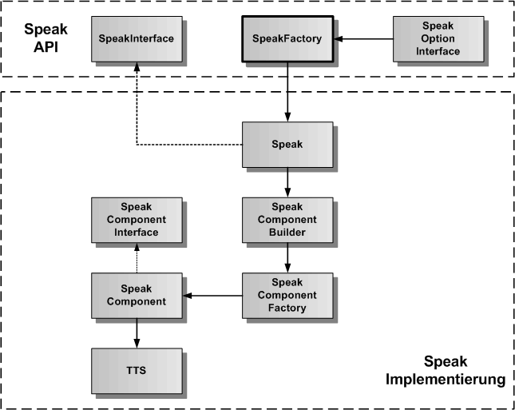
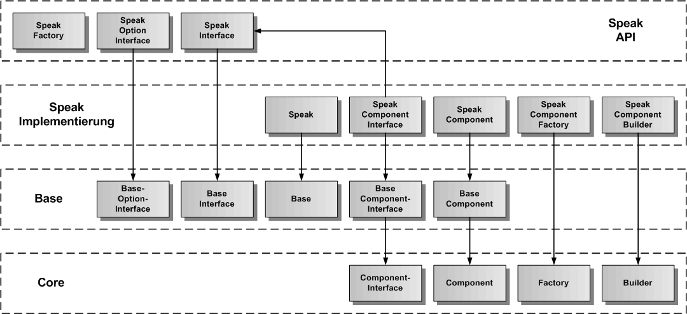
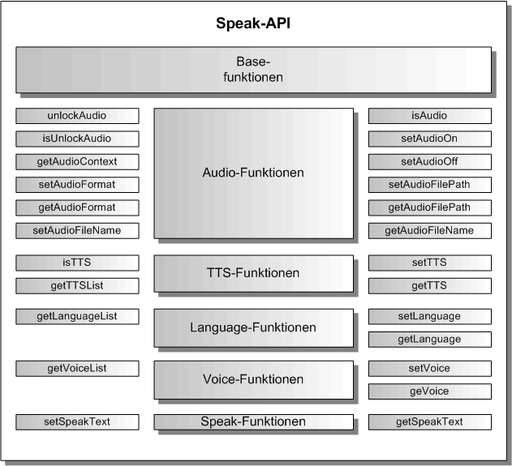

# Speak Komponente

Die Speak-Komponente ist eine exportierbare Hauptkomponente und erlaubt die Sprachausgabe zu einem übergebenen Text. Sie erbt die generische Komponenten-API von der [Base-Komponente](./../base/Base.md), so dass hier nur noch die Funktionen beschrieben werden, die gegenüber der Base-Komponente hinzukommen.

Die Speak-Komponente liefert die Sprachausgabe zu einem übergebenen Text. In der Speak-Komponente sind zur Zeit zwei TTS implementiert, einmal die Html5-TTS mit Web Speech-Synthesis API, und die andere TTS ist von Nuance. Dazu benutzt die Speak-Komponente den Nuance Cloud-Port, der eine TTS als Nuance-Service beinhaltet.

## Speak Architektur

In der folgenden Grafik ist die Architektur der Speak-Komponente dargestellt. Entsprechend dem Komponentenmodell gibt es eine API-Schicht und eine Implementierung-Schicht. Es gibt die SpeakFactory als Singleton in der API-Schicht, um ein Objekt der Klasse Speak (API-Wrapper), die das SpeakInterface implementiert, zu erzeugen. Die Speak-Klasse kümmert sich um die Erzeugung des SpeakComponent-Objektes mit der TTS als Plugin. Der SpeakComponentBuilder erzeugt nicht nur das SpeakComponent-Objekt, sondern auch alle inneren Objekte und ihre Verbindungen untereinander.

## Speak Vererbungsstruktur

In der nächsten Grafik wird die Vererbungsstruktur der Speak-Komponente dargestellt. Speak erbt von Base und Base erbt von Core. Die Speak-Komponente wird in Speak-API und Speak-Implementierung aufgeteilt. Zu sehen ist, von welcher Basisklasse die einzelnen Speak-Klassen erben.

## Speak API

Die Speak-API erweitert die Base-API um die Audio-, TTS-, Language-, Voice- und Speak-Funktionen.

### Speak erzeugen

Um die Speak-Kompnente zu erzeugen, wird die SpeakFactory verwendet:

	import { SpeakFactory, SpeakInterface, SPEAK_COMPONENT_NAME } form 'speech-framework';
	
	const speak = SpeakFactory.create( SPEAK_COMPONENT_NAME );

### Event-Funktionen

Als Event kommt der AudioUnlockEvent zu den Events der Base-Komponente dazu:

Eintragen des AudioUnlock-Events:

	const result = speak.addAudioUnlockEvent('<CallerComponent>', (aUnlockFlag: boolean) => {
		console.log('AudioUnlock', aUnlockFlag);
		return 0;
	});
	
	
Entfernen des AudioUnlock-Events:

	const result = speak.removeAudioUnlockEvent('<CallerComponent>');

### Audio-Funktionen

Die Audio-Funktionen dienen der Umschaltung der Sprachausgabe auf das Abspielen von Audiodateien. Unter Google Chome, Opera und Safari muss der AudiContext jeweils durch eine Benutzeraktion freigeschaltet werden.

Ob der AudioContext freigeschaltet ist kann mit isUnlockAudio() festgestellt werden:

	if ( speak.isUnlockAudio()) {
		console.log('AudioContext ist freigeschaltet');
	} else {
		console.log('AudioContext ist nicht freigeschaltet');
	}

Audio kann anstelle der TTS für die Sprachausgabe verwendet werden. Dazu dienen folgende Funktionen:

	const result = speak.setAudioOn();
	
	if ( speak.isAudio()) {
		console.log('Audio-Sprachausgabe ist eingeschaltet');
	}
	
	const result = speak.setAudioOff();

	if ( !speak.isAudio()) {
		console.log('Audio-Sprachausgabe ist ausgeschaltet');
	}
	
	
Den globalen AudioContext erhält man über getAudioContext() zurück:
	
	const audioContext = speak.getAudioContext();

Das Audioformat der azuspielenden Audiodateien kann man mit setAudioFormat() einstellen und mit getAudioFormat abfragen:

	const result = speak.setAudioFormat( SPEAK_MP3_FORMAT );

	const audioFormat = speak.getAudioFormat(); 
	if ( audioFormat === SPEAK_MP3_FORMAT ) {
		console.log('AudioFormat ist MP3');
	}
	
	const result = speak.setAudioFormat( SPEAK_WAV_FORMAT );
	const audioFormat = speak.getAudioFormat(); 
	if ( audioFormat === SPEAK_WAV_FORMAT ) {
		console.log('AudioFormat ist WAV');
	}
	

Um eine Audiodatei abspielen zu können, muss der Audio-Dateipfad und der Audio-Dateiname an Speak übergeben werden:

	const result = speak.setAudioFilePath( './assets/audio' );
	
	const audioPath = speak.getAudioFilePath();
	
	const result = speak.setAudioFileName( '<AudioDatei>' );
	
	const audioFile = speak.getAudioFileName();
		
	

### TTS-Funktionen

Die TTS-Funktionen erlauben den Wechsel der TTS. Im Moment sind die Html5-TTS, die Nuance-TTS und die Amazon-TTS implementiert.

	const result = speak.setTTS( SPEAK_HTML5_TTS );
	const tts = speak.getTTS();

	if ( tts === SPEAK_HTML5_TTS ) {
		console.log('HTML5-TTS ist eingestellt');
	}

	const result = speak.setTTS( SPEAK_NUANCE_TTS );

	const result = speak.setTTS( SPEAK_AMAZON_TTS );
	
	
Eine Liste der Namen aller verfügbaren TTS kann mit getTTSList() erhalten werden:

	const ttsList = speak.getTTSList();	
	

### Language-Funktionen

Die Language-Funktionen erlauben den Wechsel der Sprache. Im Moment sind Deutsch (de) und Englisch (en) implementiert.

	const result = speak.setLanguage( SPEAK_DE_LANGUAGE );
	
	const language = speak.getLanguage();
	if ( language === SPEAK_DE_LANGUAGE ) {
		console.log('Deutsch ist als Sprache eingestellt');
	}
	
	const result = speak.setLanguage( SPEAK_EN_LANGUAGE );

	const language = speak.getLanguage();
	if ( language === SPEAK_EN_LANGUAGE ) {
		console.log('Englisch ist als Sprache eingestellt');
	}
	
	
Eine Liste aller verfügbaren Sprachen kann mit getLanguageList() erhalten werden:

	const languageList = speak.getLanguageList();		
	
### Voice-Funktionen

Die Voice-Funktionen erlauben das Einstellen einer anderen Stimme für die Sprachausgabe. Die Stimmen wechseln mit der Änderung der Sprache.

	const result = speak.setVoice( '<Voice1>' );
	
	const voice = speak.getVoice();
	if ( voice === '<Voice1>' ) {
		console.log('Stimme <Voice1> ist eingestellt');
	}
	
	
Eine Liste aller verfügbaren Stimmen kann mit getVoiceList() erhalten werden:

	const voiceList = speak.getVoiceList();

### Speak-Funktionen

Die Speak-Funktionen erlauben die Übergabe eines Textes für die Sprachausgabe mit der TTS.

	const result = speak.setSpeakText( 'zu sprechender Text' );
	
	const text = speak.getSpeakText(); 

### Start der Sprachausgabe

Die Sprachausgabe startet man mit start(). Dabei muss je nach Ausgabe über die TTS oder den Audio-Player vorher ein Text oder eine Audiodatei eingetragen werden. Die Sprachausgabe beendet sich selbst oder kann mit stop() abgebrochen werden. Die Events für Start und Stop werden ausgelöst.

Zunächst die Events einrichten:

	const result = speak.addStartEvent( 'Test', () => {
		console.log('Sprachausgabe gestartet');
	});
	
	const result = speak.addStopEvent( 'Test', () => {
		console.log('Sprachausgabe beendet');
	});
	

Für die Sprachausgabe mit TTS:

	const result = speak.setText( 'zu sprechender Text' );
	const result = speak.start();
	
	
Für die Sprachausgabe mit Audio:

	const result = speak.setAudioOn();
	const result = speak.setAudioFileName( '<AudioDatei>' );
	const result = speak.start();

